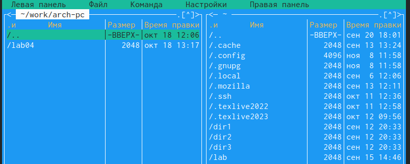

---
## Front matter
title: "Отчёт по лабораторной работе №5"
subtitle: "Дисциплина: архитектура компьютера"
author: "Аветисян Алина Эдуардовна НММбд-01-23"

## Generic otions
lang: ru-RU
toc-title: "Содержание"

## Bibliography
bibliography: bib/cite.bib
csl: pandoc/csl/gost-r-7-0-5-2008-numeric.csl

## Pdf output format
toc: true # Table of contents
toc-depth: 2
lof: true # List of figures
lot: true # List of tables
fontsize: 12pt
linestretch: 1.5
papersize: a4
documentclass: scrreprt
## I18n polyglossia
polyglossia-lang:
  name: russian
  options:
	- spelling=modern
	- babelshorthands=true
polyglossia-otherlangs:
  name: english
## I18n babel
babel-lang: russian
babel-otherlangs: english
## Fonts
mainfont: PT Serif
romanfont: PT Serif
sansfont: PT Sans
monofont: PT Mono
mainfontoptions: Ligatures=TeX
romanfontoptions: Ligatures=TeX
sansfontoptions: Ligatures=TeX,Scale=MatchLowercase
monofontoptions: Scale=MatchLowercase,Scale=0.9
## Biblatex
biblatex: true
biblio-style: "gost-numeric"
biblatexoptions:
  - parentracker=true
  - backend=biber
  - hyperref=auto
  - language=auto
  - autolang=other*
  - citestyle=gost-numeric
## Pandoc-crossref LaTeX customization
figureTitle: "Рис."
tableTitle: "Таблица"
listingTitle: "Листинг"
lofTitle: "Список иллюстраций"
lotTitle: "Список таблиц"
lolTitle: "Листинги"
## Misc options
indent: true
header-includes:
  - \usepackage{indentfirst}
  - \usepackage{float} # keep figures where there are in the text
  - \floatplacement{figure}{H} # keep figures where there are in the text
---

# Цель работы

Целью данной лабораторной работы является приобретение практических навыков
работы в Midnight Commander и освоение инструкций языка ассемблера mov и int.

# Выполнение лабораторной работы

Открываю Midnight Commander, введя mc

{#fig:001 width=70%}

Перехожу в каталог ~/work/arch-pc

{#fig:001 width=70%}

Создаю каталог lab05 с помощью клавиши F7

{#fig:001 width=70%}

Перехожу в каталог

{#fig:001 width=70%}

Пользуясь строкой ввода и командой touch создаю файл lab5-1.asm

{#fig:001 width=70%}

С помощью функциональной клавиши F4 открываю файл lab5-1.asm для редакти-
рования во встроенном редакторе nano. Ввожу текст программы из листинга

{ #fig:001 width=70% }

{ #fig:001 width=70% }

С помощью функциональной клавиши F3 открыла файл lab5-1.asm для про-
смотра. Убеждаюсь, что файл содержит текст программы

{ #fig:001 width=70% }

Оттранслирую текст программы lab5-1.asm в объектный файл. Выполняю
компоновку объектного файла и запускаю получившийся исполняемый
файл

{ #fig:001 width=70% }

Скачиваю файл in_out.asm со страницы курса в ТУИС (сохранился в каталоге
“Загрузки”)

{#fig:001 width=70%}

Копирую файл in_out.asm из каталога “Загрузки” в созданный каталог lab05
с помощью клавиши F5

{#fig:001 width=70%}

{#fig:001 width=70%}

Создаю копию файла lab5-1.asm с именем lab5-2.asm

{#fig:001 width=70%}

Изменяю содержимое файла lab5-2.asm во встроенном редакторе nano, чтобы
были использованы подпрограммы из внешнего файла in_out.asm

{#fig:001 width=70%}

Транслирую текст программы файла в объектный файл; создался объектный
файл; выполняю компоновку объектного файла; создался исполняемый файл;
запускаю исполняемый файл

{#fig:001 width=70%}

В файле lab5-2.asm заменяю подпрограмму sprintLF на sprint

{#fig:001 width=70%}

Создаю исполняемый файл и проверяю его работу(используя подпрограмму sprintLF запрашивается ввод с новой строки,а при sprint  запрашивается ввод без переноса на новую строку)(рис. [-@fig:015]).

{#fig:001 width=70%}

# Выполнение заданий для самостоятельной работы

### Задание №1

Копирую файл lab5-1.asm с именем lab5-1-1.asm

{#fig:001 width=70%}

{#fig:001 width=70%}

С помощью функциональной клавиши F4 открываю созданный файл для редактирования. 
Изменяю программу так, чтобы кроме вывода приглашения и запроса ввода, она выводила вводимую пользователем строку

{#fig:001 width=70%}

Coздаю объектный файл lab6-1-1.o, отдаю его на обработку компоновщику, получаю исполняемый файл lab6-1-1, запускаю полученный исполняемый файл. 
Программа запрашивает ввод, ввожу свои ФИО, далее программа выводит введенные мною данные 

{#fig:001 width=70%}

### Задание №2

Создаю копию файла lab5-2.asm с именем lab5-2-1.asm с помощью функциональной клавиши F5

{#fig:001 width=70%}

С помощью функциональной клавиши F4 открываю созданный файл для редактирования. Изменяю программу так, 
чтобы кроме вывода приглашения и запроса ввода, она выводила вводимую пользователем строку

{#fig:001 width=70%}

Создаю объектный файл lab5-2-1.o, отдаю его на обработку компоновщику, получаю исполняемый файл lab5-2-1, запускаю полученный исполняемый файл.
 
Программа запрашивает ввод без переноса на новую строку, ввожу свои ФИО, далее программа выводит введенные мною данные

{#fig:001 width=70%}

# Выводы

Я приобрела практические навыки работы в Midnight Commander и освоила инструкции mov и int в языке ассемблер.

::: {#refs}
:::
